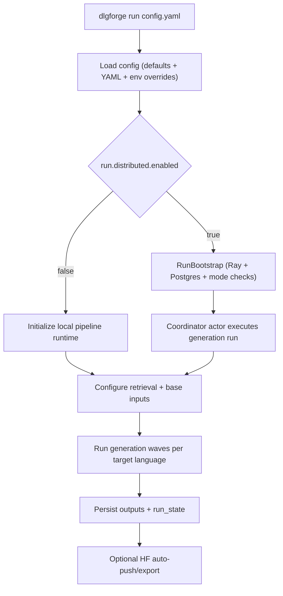
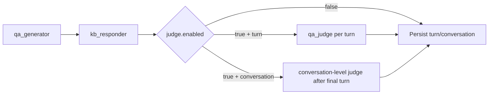
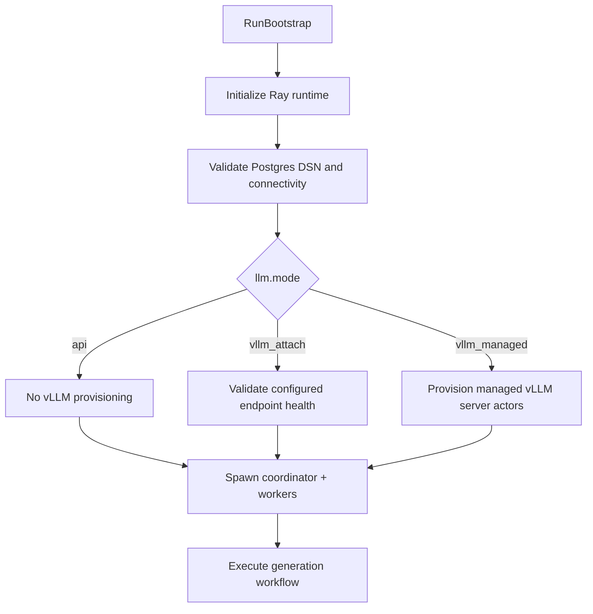

# Architecture

## System purpose
DialogForge generates grounded synthetic multi-turn conversations with deterministic dedup behavior, resumable run state, and export-ready outputs. The system is built around a small CLI contract and a modular pipeline that can run locally or through distributed bootstrap.

## End-to-end execution flow

## Turn pipeline

## Distributed bootstrap sequence

## Core module boundaries
- `src/dlgforge/cli.py`: external command surface and dispatch.
- `src/dlgforge/config`: config defaults, loader, and resolver layer.
- `src/dlgforge/pipeline/runner.py`: top-level generation orchestration.
- `src/dlgforge/pipeline/sampling.py`: question selection, coverage memory, and seed-topic mechanics.
- `src/dlgforge/tools/retrieval.py`: vector index lifecycle and retrieval operations.
- `src/dlgforge/io/output.py`: output paths and artifact writing.
- `src/dlgforge/pipeline/state.py`: resume/checkpoint state handling.
- `src/dlgforge/distributed`: bootstrap and backend provisioning abstractions.
- `src/dlgforge/pipeline/hf_push.py`: export packaging and hub push flow.

## Data and state model
- Conversation and turn artifacts are written under `saving.output_dir`.
- Run progress is checkpointed in `run_state` files keyed by `run_id`.
- Dedup/coverage memory is tracked in append-oriented ledgers.
- Resume uses persisted run-state and memory artifacts to continue without replaying accepted outputs.

## Stability model
- Stable operator-facing contracts in `v0.1.x`: CLI commands, documented config surfaces, and output layouts.
- Internal module structure under `src/dlgforge` is not a stability contract.
