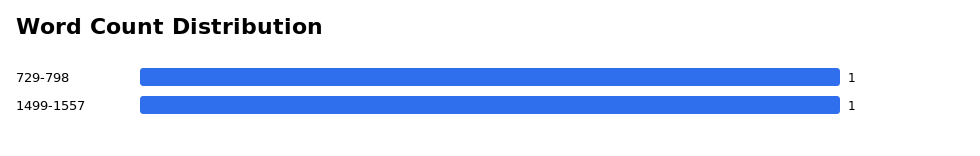
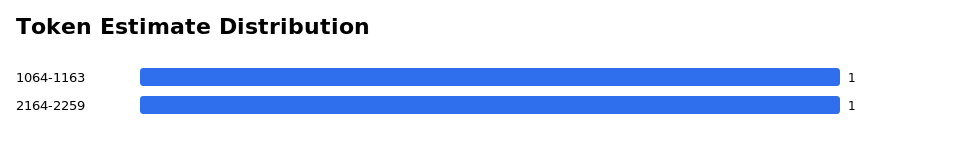

---
configs:
  - config_name: default
    data_files:
      - split: train
        path: conversations_sharegpt_judged.jsonl
language:
  - en
  - ar
task_categories:
  - question-answering
tags:
  - synthetic
  - rag
  - multi-turn
---

# dialogforge-sample

Synthetic multi-turn QA conversations generated with dlgforge.

## Contents
- `conversations_sharegpt_judged.jsonl`
- `dataset_stats.json`
- `plots/turn_count_distribution.svg`
- `plots/judge_avg_score_distribution.svg`
- `plots/word_count_distribution.svg`
- `plots/token_estimate_distribution.svg`

## Stats
- records: 2
- turn_count.avg: 5.5
- turn_count.min: 5
- turn_count.max: 6
- judge.conversations_with_scores: 2
- judge.avg_score_mean: 5.0
- text.avg_words_per_conversation: 1143.0
- text.avg_tokens_per_conversation_estimate: 1661.5

## Full Stats JSON
See `dataset_stats.json` for full distributions and aggregates.

## Plots
### Turn Count Distribution

### Judge Avg Score Distribution

### Word Count Distribution

### Token Estimate Distribution

